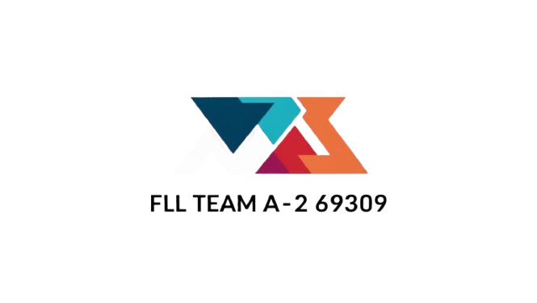

# 🌊 DIY-ROV  

  

Welcome to the **DIY-ROV** GitHub repository! This project is dedicated to open-source Remotely Operated Vehicle (ROV) designs, tutorials, and software for underwater exploration enthusiasts.  

🔗 **Live Site:** [DIY-ROV.com](https://diy-rov.com)  
📂 **Repository:** [DIY-ROV on GitHub](https://github.com/FLLA2Offical/DIY-ROV.github.io/tree/main)  

---

## 🚀 About This Project  

DIY-ROV.com provides resources to help you build and customize your own underwater ROV, from hardware schematics to software controls. Whether you're a hobbyist or an engineer, this site offers valuable insights into underwater robotics.  

## 🔧 Features  
✅ Open-source ROV designs  
✅ Electronics and wiring diagrams  
✅ Control software & firmware  
✅ Community contributions and discussions  

## 📂 Repository Structure  
/docs # Technical documentation & guides
/hardware # CAD files, 3D models, and schematics
/software # ROV control software & firmware
/examples # Sample projects and community contributions

bash
Copy
Edit

## 📜 Getting Started  
1. Clone the repository:  
   ```bash
   git clone https://github.com/FLLA2Offical/DIY-ROV.github.io.git
   cd DIY-ROV.github.io
Explore the documentation and resources.

Contribute or customize your own ROV!

🤝 Contributing
We welcome contributions! If you have improvements, new designs, or fixes, please submit a pull request or open an issue.

📢 Stay Connected
🌐 Website: DIY-ROV.com
📧 Contact: Reach out via GitHub
